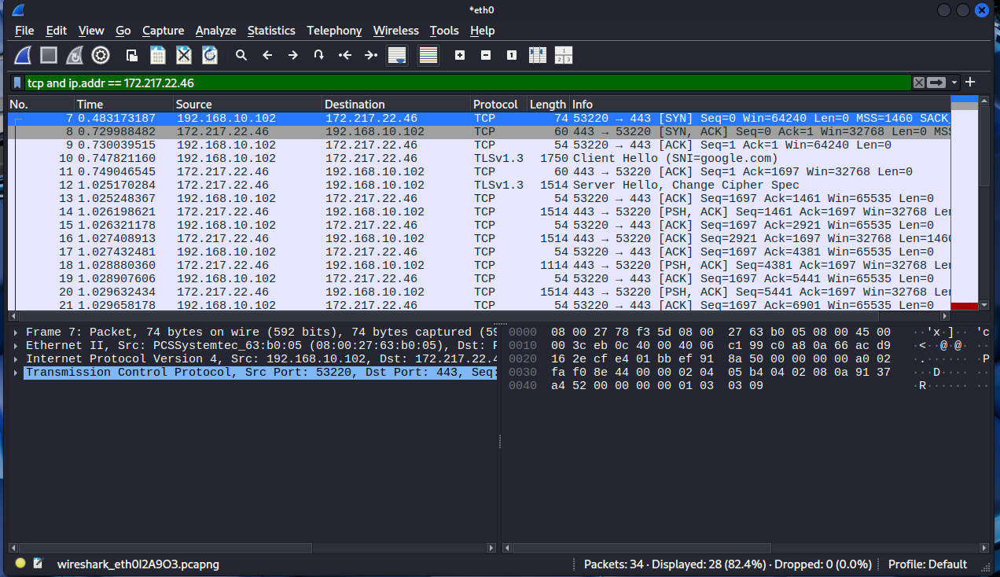
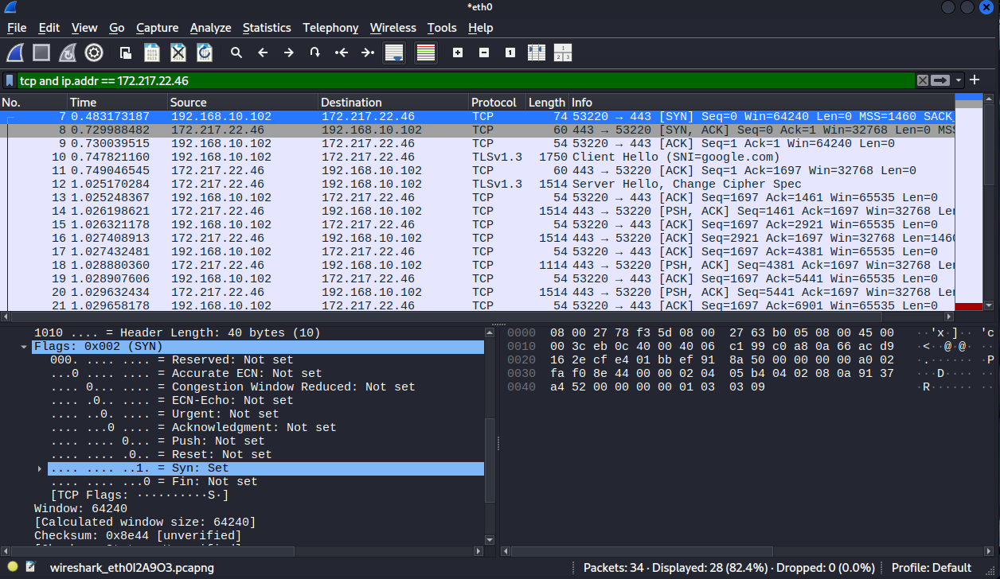
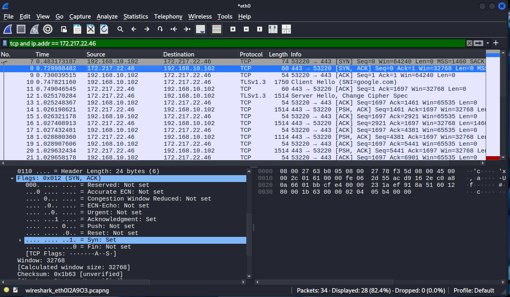
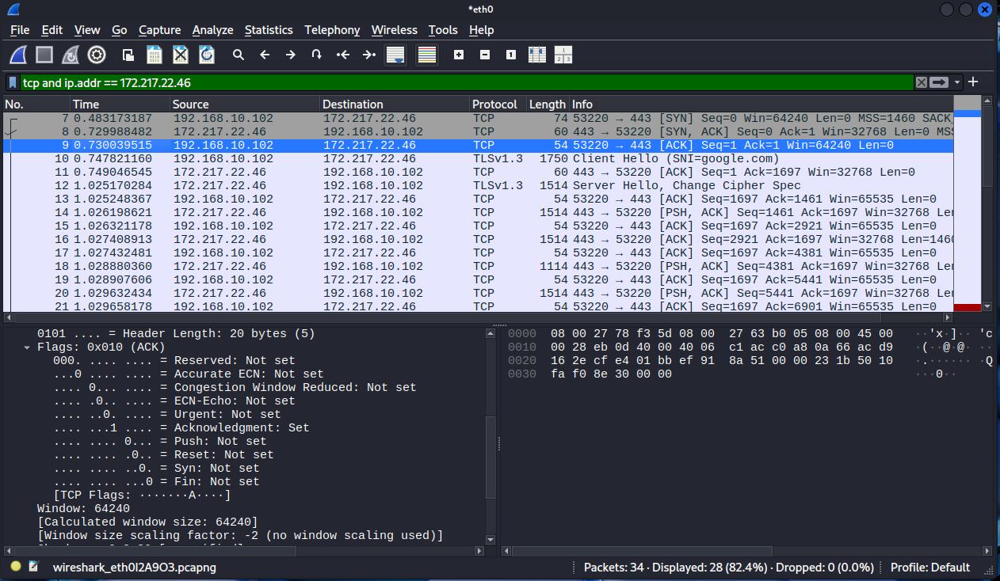
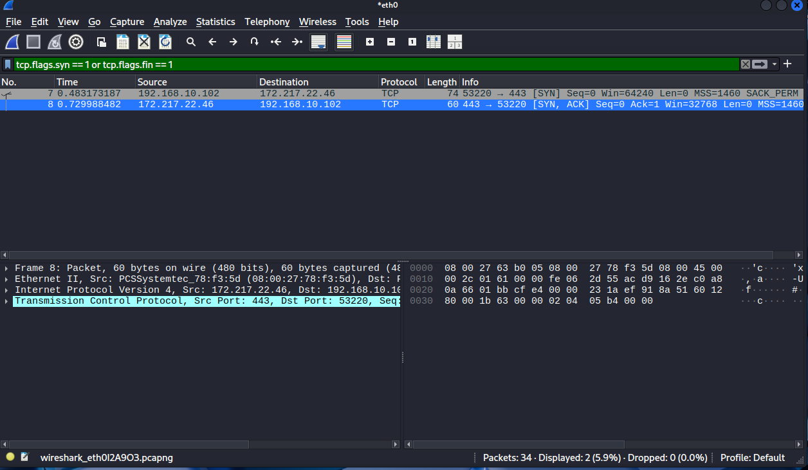

# TCP/IP Traffic Analysis Using Wireshark
## Capturing and Analyzing Real TCP Handshakes

---

## Overview
Understanding TCP/IP is fundamental to SOC analysis.
Every attack(brute force, port scanning, session 
hijacking) uses TCP/IP. This project captures and 
analyzes real TCP handshakes between Kali Linux and 
a live server to demonstrate how connections are 
established and what analysts look for in traffic.

---

## Objectives
- Generate real TCP traffic using curl
- Capture live TCP handshakes in Wireshark
- Identify and analyze SYN, SYN-ACK and ACK packets
- Understand TCP flags and sequence numbers
- Apply Wireshark filters to isolate handshake packets

---

## Tools Used
| Tool | Purpose |
|---|---|
| **Wireshark** | Network packet capture and analysis |
| **Kali Linux** | Traffic generation platform |
| **curl** | HTTP request tool to generate TCP traffic |
| **TCP/IP** | Protocol analyzed |

---

## TCP/IP Background

### What is TCP?
TCP (Transmission Control Protocol) is a connection
oriented protocol. It establishes a connection 
before sending any data and confirms delivery.

### The 3-Way Handshake
Every TCP connection starts with a 3-way handshake:

Step 1 — SYN
Client sends connection request with sequence number 0

Step 2 — SYN-ACK
Server responds accepting connection and acknowledges

Step 3 — ACK
Client confirms, that means connection established

### TCP Flags Reference
| Flag | Meaning | When you see it |
|---|---|---|
| SYN | Start connection | Beginning of every connection |
| ACK | Acknowledge receipt | Almost every packet after SYN |
| FIN | Close connection gracefully | End of session |
| RST | Close connection immediately | Port closed or forced termination |
| PSH | Send data immediately | Data transfer |
| URG | Urgent data | Rare — priority traffic |

---

## Methodology

### Step 1 — Start Wireshark Capture
Started Wireshark on eth0 interface on Kali Linux
to capture all live network traffic.

### Step 2 — Generate TCP Traffic
Used curl to send HTTP request to Google:
curl http://google.com
This generated a real TCP handshake recorded
by Wireshark in real time.

### Step 3 — Apply Wireshark Filters

Filter all TCP traffic to Google:
tcp and ip.addr == 172.217.22.46

Filter SYN and FIN packets only:
tcp.flags.syn == 1 or tcp.flags.fin == 1

---

## Results

### All TCP Traffic Filtered

### SYN Packet — Connection Request

### SYN-ACK Packet — Server Response

### ACK Packet — Handshake Complete

### Full Handshake View

---

## Analysis

### Finding 1 — 3-Way Handshake Confirmed
The complete TCP handshake was captured:

| Packet | Direction | Flags | Meaning |
|---|---|---|---|
| 7 | Kali → Google | SYN | Connection request |
| 8 | Google → Kali | SYN-ACK | Connection accepted |
| 9 | Kali → Google | ACK | Handshake complete |

### Finding 2 — Port Analysis
Client port: 53220 — dynamic randomly assigned
Server port: 443 — well-known HTTPS port

Client uses random dynamic port (49152-65535).
Server always uses fixed well-known port.
This immediately identifies client vs server
in any packet capture.

### Finding 3 — Sequence Numbers
SYN:     Seq=0
SYN-ACK: Seq=0 Ack=1
ACK:     Seq=1 Ack=1

Sequence numbers track data delivery and order.
This is what session hijacking attacks try to
predict. They try guessing the next sequence number to
take over an active connection.

### Finding 4 — Encryption Identified
Traffic used TLSv1.3 over TCP port 443, this means that the connection was encrypted with the latest
TLS standard. An attacker intercepting this
traffic would see only encrypted data.

---

## Security Relevance

### How Attackers Abuse TCP

| Attack | What happens | Detection |
|---|---|---|
| **SYN Flood** | Thousands of SYN with no ACK | Many SYNs from one IP |
| **Port Scan** | SYN to many ports rapidly | Sequential port SYNs |
| **Session Hijack** | Attacker guesses sequence number | Unexpected RST packets |
| **TCP Reset** | Forged RST kills connections | RST without prior connection |

### How Analysts Use This Knowledge
- SYN without ACK = suspicious
- Many SYNs in seconds = port scan or flood
- RST after SYN-ACK = SYN scan
- Dynamic port identifies client
- Well-known port identifies server

---

## Conclusion
Successfully captured and analyzed a real TCP
3-way handshake between Kali Linux and Google.
Understanding TCP handshakes is fundamental to:
- Detecting port scans
- Identifying SYN floods
- Recognizing session hijacking attempts
- Analyzing any network attack

---

## 🔗 Related Projects
- [Network Traffic Analysis](https://github.com/Phredreeq/network-traffic-analysis-wireshark)
- [Firewall Log Analysis](https://github.com/Phredreeq/firewall-log-analysis)
- [DNS Analysis](https://github.com/Phredreeq/dns-analysis-threat-detection)

---

## 👤 Author
Fredrick Agufenwa

Cybersecurity Student | SOC & Threat Detection
